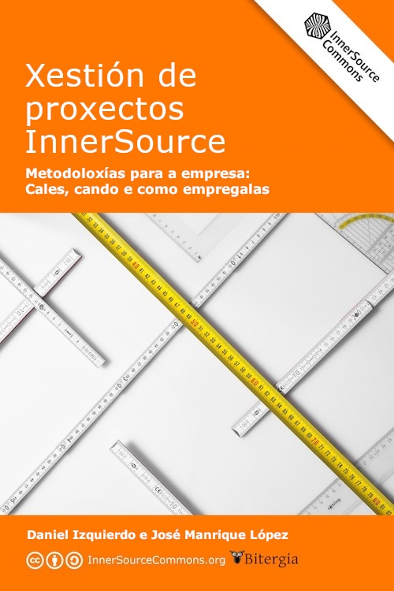

# Resumo

Este libro busca proporcionar información sobre a xestión de distintos aspectos indispensables á hora de empregar InnerSource nas empresas.

É o resultado dun proceso aínda en marcha, no que calquera persoa está convidada a contribuír de calquera xeito posible. As aportacións en forma de ideas, comentarios, correccións de erros tipográficos, ou mesmo cambios en parágrafos ou seccións enteiras, serán benvidas. Este repositorio ten como obxectivo aportar coñecemento especializado desde a industria de maneira que sexa útil a terceiros/as. Para isto, estamos na procura activa de revisores/as que poidan colaborar neste proceso e expresamos o noso agradecemento a aquelas persoas que xa fixeron algunha contribución ao libro.

Pode atopar máis información sobre este proceso na [sección de contribucións](https://github.com/dicortazar/managing-inner-source-projects/blob/master/CONTRIBUTING.md).

## Quen está a impulsar esta iniciativa?

Bitergia, como actor neutral no eido da análise do desenvolvemento de software, tenta compartir o coñecemento adquirido durante os últimos anos. Este libro céntrase nas súas principais áreas de especialización, como son o uso de métricas e KPI, a metodoloxía, as métricas arredor da estratexia xeral de InnerSource ou a infraestrutura necesaria coa que percorrer con éxito a senda de InnerSource dentro da súa empresa.

Este documento está aberto a calquera con interese en InnerSource, tanto se aínda está en proceso de aplicalo e quere compartir o seu caso, como se xa está a empregar con éxito InnerSource no seu proceso interno de desenvolvemento de software.

## Referencias

Se desexa ampliar esta información, animámolo a participar na [web InnerSource Commons](https://paypal.github.io/InnerSourceCommons/) financiada por PayPal, na que ducias de empresas xa están a compartir as súas experiencias e a traballar na procura dun mellor entendemento do funcionamento de InnerSource. Un gran recurso co que poder considerar o enfoque doutras compañías, ao tempo que se aprende durante o proceso.

Para rematar, se vostede está interesado/a en participar dunha enquisa na que compartir os coñecementos da súa organización sobre a materia, bótelle unha ollada á [Enquisa de InnerSource](https://paypal.github.io/InnerSourceCommons/assets/files/InnerSourceCommonsSurvey2016.pdf).

## Agradecementos

Cada capítulo do libro orixinal (en inglés) foi escrito e revisado por diferentes persoas. Esa información está dispoñible ao comezo de cada capítulo. Esta iniciativa foi impulsada por [Bitergia](https://bitergia.com); aínda que, por mor dalgúns problemas técnicos, finalmente decidiron colgar o libro nun repositorio persoal.

Se ten algunha pregunta, pode pórse en contacto con José Manrique López ou Daniel Izquierdo (jsmanrique | dizquierdo) en bitergia punto com.

Grazas polo seu interese.

A portada do libro foi creada por [Sebastian Spier](https://spier.hu), a partir dunha imaxe do usuario [Bru-nO](https://pixabay.com/photos/measure-unit-of-measure-meterstab-2737004/), dispoñible baixo a [licenza Pixabay](https://pixabay.com/service/license/).

Todo o contido que se atopa neste repositorio ten licenza [CC BY-SA 4.0](https://creativecommons.org/licenses/by-sa/4.0/).

## Sobre a tradución

Esta tradución á lingua galega foi elaborada pola [AMTEGA](https://amtega.xunta.gal) (Xunta de Galicia). Cofinanciada a través de Fondos Europeos.

Distribúese baixo licenza Creative Commons Atribución - Compartir Igual 4.0 Internacional (CC BY-SA 4.0). Pode consultar as condicións desta licenza [aquí](https://creativecommons.org/licenses/by-sa/4.0/deed.gl).

**Autoras da tradución:**

* Leticia Gómez Cadahía
* María Lucía González Castro
* Vanesa Pol Hermida

